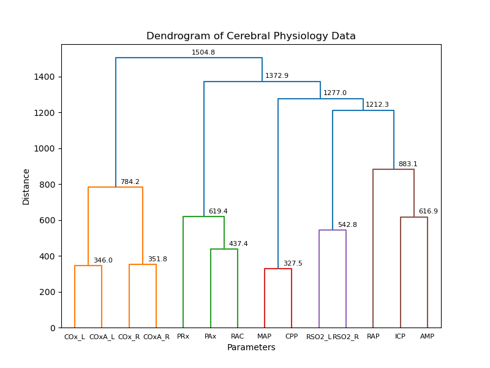
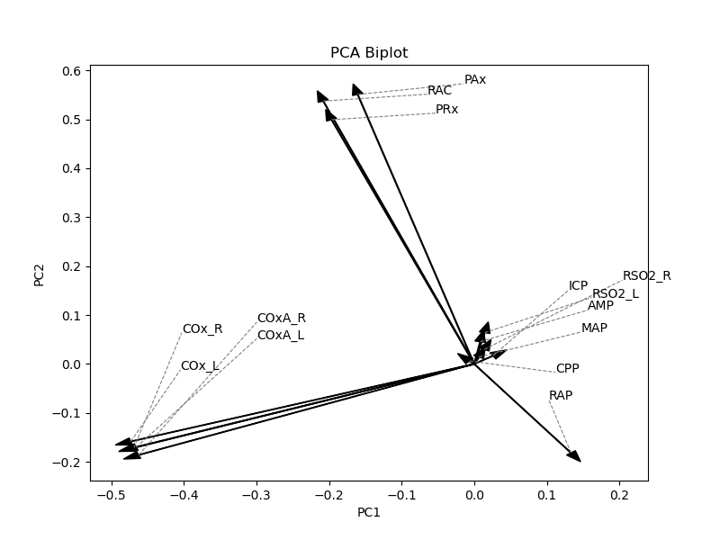
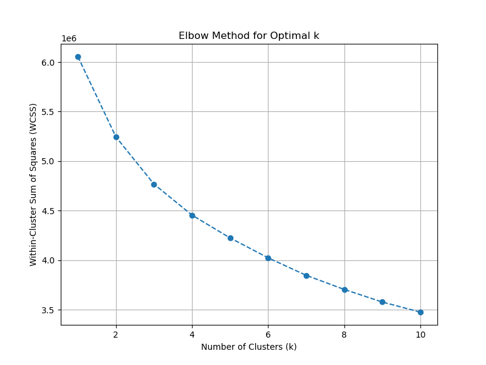

# Time Series Covariance Pattern Analysis

Application of semi-supervised ML methods to identify hidden covariance patterns among time series EEG signals.


<p>
  
  
  
  
<p>

## Table of Contents

- [About](#about)
- [Features](#features)
- [Data](#data)
- [Method](#method)
- [Result](#result)
- [Quick Start](#quick-start)
- [Installation](#installation)
- [Project Structure](#project-structure)
- [Associated Publication](#associated-publication)
- [Contributing](#contributing)
- [Support](#support)
- [Acknowledgments](#acknowledgments)
  
## About

This repository provides tools for analyzing time-series EEG and physiological signals using semi-supervised machine learning. It focuses on uncovering hidden covariance patterns, performing variable clustering, and conducting subgroup analysis based on signal characteristics. The code includes preprocessing, scaling, K-means and hierarchical clustering, PCA, and RAP-based segmentation, enabling researchers to explore complex temporal relationships and discover meaningful signal patterns.

The analysis leverages libraries such as NumPy, Pandas, and scikit-learn within a Jupyter Notebook environment for interactive data exploration and model development. By identifying covariance patterns, we hope to provide valuable insights into the dynamic interactions within the brain and contribute to advancements in neurological research and clinical applications. This work has been published in MDPI's Bioengineering. The link to that can be found in the following section. 

## Features

- 🎯 **Covariance Pattern Identification**: Utilizes semi-supervised learning to identify covariance patterns among time series EEG signals.
- 🧩 **Subgroup Analysis**: Provides subgroup analysis for a comprehensive result.
- 📏 **Resolution Analysis**: Provides analysis across resolutions for a comparison and understanding of the potential role of resolution.
- ⚡ **Efficient Analysis**: Employs optimized algorithms for fast and accurate covariance matrix computation.
- 🎨 **Visualization**: Provides tools for visualizing covariance patterns and EEG data.
- 🛠️ **Extensible**: Modular design allows for easy integration of new machine learning models and EEG datasets.
  
## Method

```text

Covariance Analysis Workflow
│
├── 1. Data Preparation
│   ├── Exclude patients with missing values
│   ├── Form three parameter groups:
│   │     • ICP–ABP parameters
│   │     • ICP–ABP + NIRS parameters
│   │     • ICP–ABP + PbtO2
│   └── Apply analysis at:
│         • 1-min resolution
│         • Lower temporal resolutions
│         • Three RAP states (intact / impaired / severely impaired)
│
├── 2. Agglomerative Hierarchical Clustering (AHC)
│   ├── Use Euclidean distance
│   ├── Build dendrograms (SciPy hierarchy)
│   ├── Inspect merging patterns for similarity groups
│   └── Quantify structure using cophenetic correlation
│
├── 3. Principal Component Analysis (PCA)
│   ├── Reduce dimensionality (scikit-learn PCA)
│   ├── Generate biplots (PC1–PC2)
│   ├── Identify correlated parameters via vector alignment
│   └── Examine explained variance (scree + cumulative plots)
│
└── 4. K-Means Clustering (KMCA)
    ├── Use Euclidean similarity
    ├── Compute WCSS across k values
    ├── Apply elbow method to select optimal k
    └── Fit clusters using scikit-learn KMeans

```

## Result

### AHC Dendrogram of Full Data


### PCA Biplot of Full Data


### KMCA Elbow Mehod of Full Data


# Quick Start

Clone the repository and run the main script:

```bash
git clone https://github.com/Abrar-Islam-Oitijjho/Time-Series-Covariance-Pattern-Analysis.git
cd Time-Series-Covariance-Pattern-Analysis
pip install -r requirements.txt
jupyter notebook covariance_pattern_analysis_main(with_sub_group_resolution).ipynb
```

## Installation

### Prerequisites
- Python 3.7+
- pip 22.3+
- conda 24.11.3
- scikit-learn 1.0.2
- Pandas 1.3.5

## Project Structure

```
ARIMA-Modeling-on-EEG-Time-Series-Data/
├── code/                      
    └── covariance_pattern_analysis_main(with_sub_group_resolution).ipynb           
├── plots/
    ├── ahc        
    ├── kmca
    └── pca
├── README.md              
└── requirements.txt                 
```

## Associated Publication

[Relationship Between RAP and Multi-Modal Cerebral Physiological Dynamics in Moderate/Severe Acute Traumatic Neural Injury: A CAHR-TBI Multivariate Analysis](https://www.mdpi.com/1424-8220/25/2/586)

## Contributing

Contributions are welcome!

### Quick Contribution Steps
1. 🍴 Fork the repository
2. 🌟 Create your feature branch (`git checkout -b feature/AmazingFeature`)
3. ✅ Commit your changes (`git commit -m 'Add some AmazingFeature'`)
4. 📤 Push to the branch (`git push origin feature/AmazingFeature`)
5. 🔃 Open a Pull Request


## Support

- 📧 **Email**: abraroitijjho35@gmail.com
- 🐛 **Issues**: [GitHub Issues](https://github.com/Abrar-Islam-Oitijjho/ARIMA-Modeling-on-EEG-Time-Series-Data/issues)

## Acknowledgments

- 📚 **Libraries used**:
  - [NumPy](https://numpy.org/) - Numerical computing library
  - [Pandas](https://pandas.pydata.org/) - Data analysis library
  - [Matplotlib](https://matplotlib.org/) - Visualization library
  - [Statsmodels](https://www.statsmodels.org/stable/index.html) - Statistical modeling library
  - [Scikit-learn](https://scikit-learn.org/stable/) - Machine learning library
    
🌟 Special thanks: to the Main-Hub Laboratory, University of Manitoba, for their great support.
